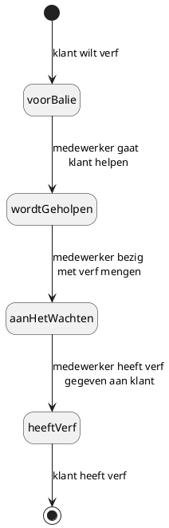

# Klant state diagram

Hieronder is een eindige toestandsdiagram te vinden van de klant

```plantuml
@startuml
hide empty description
[*] --> voorBalie : klant wilt verf
voorBalie --> wordtGeholpen : medewerker gaat\n  klant helpen
wordtGeholpen --> aanHetWachten : medewerker bezig\n met verf mengen
aanHetWachten --> heeftVerf : medewerker heeft verf\n gegeven aan klant
heeftVerf --> [*] : klant heeft verf
@enduml
```