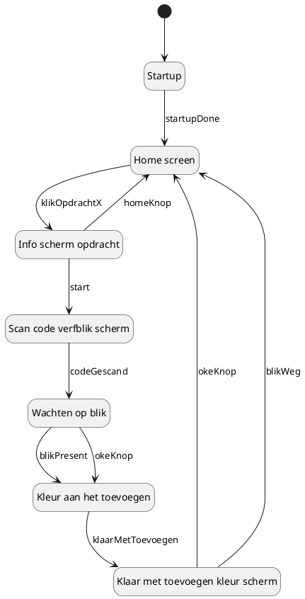

# Kleurmachine state diagram

Hieronder is een state diagram te zien van de kleurmachine.

```plantuml
@startuml
hide empty description
[*] --> Startup
State "Home screen" as home
State "Info scherm opdracht" as info
'State "Info scherm opdracht Y" as infy
State "Scan code verfblik scherm" as scan
State "Wachten op blik" as blik
State "Kleur aan het toevoegen" as klur
State "Klaar met toevoegen kleur scherm" as klar

Startup --> home : startupDone
home --> info : klikOpdrachtX
info --> home : homeKnop
'home --> infy : klikOpdrachtY
'infy --> home : homeKnop
'info -> infy : klikOpdrachtY
'infy -> info : klikOpdrachtX
info --> scan : start
'infy --> scan : start
scan --> blik : codeGescand
blik --> klur : blikPresent
blik --> klur : okeKnop
klur --> klar : klaarMetToevoegen
klar --> home : okeKnop
klar --> home : blikWeg
@enduml
```