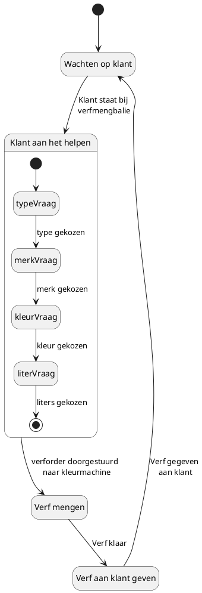

# Medewerker state diagram

Hieronder is het eindige toestandsdiagram te zien van de karwei medewerker

```plantuml
@startuml
hide empty description
State "Wachten op klant" as wok

[*] --> wok
wok --> kah : Klant staat bij \nverfmengbalie
State "Klant aan het helpen" as kah {
    [*] --> typeVraag
    typeVraag --> merkVraag : type gekozen
    merkVraag --> kleurVraag : merk gekozen
    kleurVraag --> literVraag : kleur gekozen
    literVraag --> [*] : liters gekozen
}
State "Verf mengen" as vmg
kah --> vmg : verforder doorgestuurd \n naar kleurmachine
State "Verf aan klant geven" as vkg
vmg --> vkg : Verf klaar
vkg --> wok : Verf gegeven\n aan klant

@enduml
```