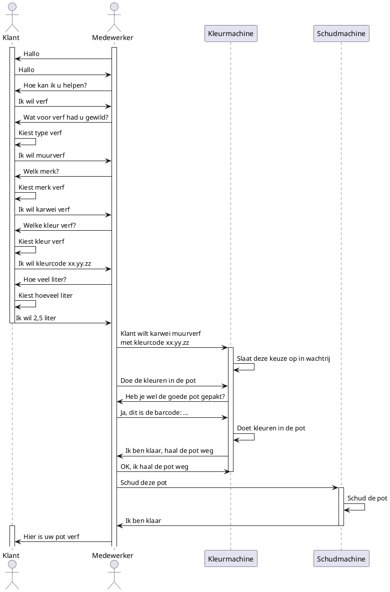

# Sequence diagram

Als routine voor deze opdracht heb ik verfmengen bij de Karwei gekozen, sinds ik werk bij de Karwei en ik dit elke week doe.

Hieronder is een sequence diagram te zien waar de communicatie tussen de actors, de klant en de medewerker, en de machines te zien is.

