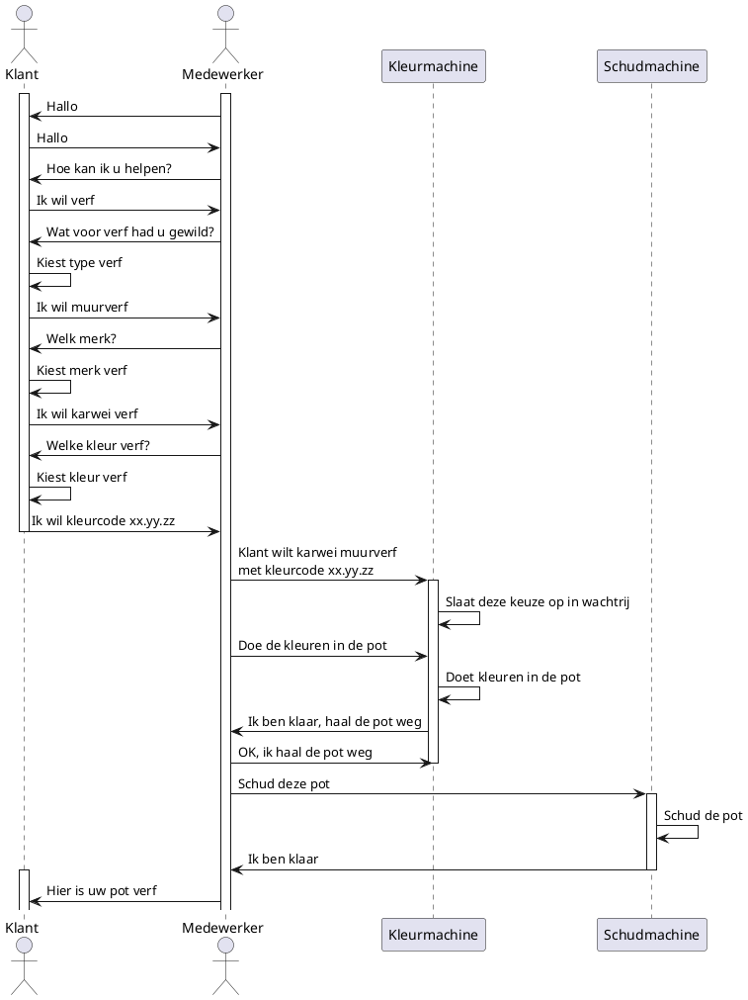

# Sequence diagram

Hieronder is een sequence 

```plantuml
@startuml
actor Klant as klt
actor Medewerker as kwm
participant Kleurmachine as klm
participant Schudmachine as sdm

activate kwm
activate klt
kwm -> klt : Hallo
klt -> kwm : Hallo
kwm -> klt : Hoe kan ik u helpen?
klt -> kwm : Ik wil verf
kwm -> klt : Wat voor verf had u gewild?
klt -> klt : Kiest type verf
klt -> kwm : Ik wil muurverf
kwm -> klt : Welk merk?
klt -> klt : Kiest merk verf
klt -> kwm : Ik wil karwei verf
kwm -> klt : Welke kleur verf?
klt -> klt : Kiest kleur verf
klt -> kwm : Ik wil kleurcode xx.yy.zz
deactivate klt
kwm -> klm : Klant wilt karwei muurverf \nmet kleurcode xx.yy.zz
activate klm
klm -> klm : Slaat deze keuze op in wachtrij
kwm -> klm : Doe de kleuren in de pot
klm -> klm : Doet kleuren in de pot
klm -> kwm : Ik ben klaar, haal de pot weg
kwm -> klm : OK, ik haal de pot weg
deactivate klm
kwm -> sdm : Schud deze pot
activate sdm
sdm -> sdm : Schud de pot
sdm -> kwm : Ik ben klaar
deactivate sdm
activate klt
kwm -> klt : Hier is uw pot verf
@enduml
```
