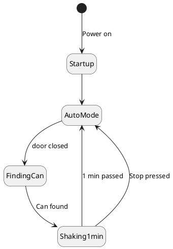

# State diagram task 1

Hieronder is een state diagram te zien van de schudmachine

```plantuml
@startuml
hide empty description
'state stopJoin <<join>>
'state timeJoin <<join>>

[*] --> Startup : Power on
Startup --> AutoMode
AutoMode --> FindingCan : door closed

FindingCan --> Shaking1min : Can found
Shaking1min --> AutoMode : 1 min passed
Shaking1min --> AutoMode : Stop pressed

'FindingCan --> Shaking1min30 : Medium can found
'Shaking1min30 --> timeJoin : 1 min 30 passed
'Shaking1min30 --> stopJoin : Stop pressed

'FindingCan --> Shaking2min : Big can found
'Shaking2min --> timeJoin : 2 min passed
'Shaking2min --> stopJoin : Stop pressed

'stopJoin --> AutoMode
'timeJoin --> AutoMode


'AutoMode -> TimeMode : Mode Button
'TimeMode -> AutoMode : Mode Button
@enduml

```

